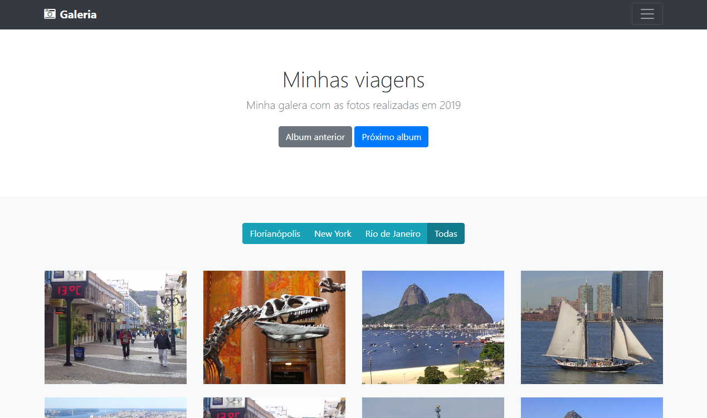

## Projeto desenvolvido no curso de Web Moderno com a equipe da [Cod3r](https://www.cod3r.com.br/) .  

Projeto Galeria é um projeto desenvolvido através do Javascript com o objetivo de ser um estudo de integração de jQuery, Bootstrap e Webpack.

  

O objetivo é criar uma galeria de fotos simples, baseado em um [exemplo existente de album](https://getbootstrap.com/docs/4.5/examples/album/#) no site do Bootstrap.

Foi adicionada a funcionalidade filtrar fotos por cidade através de botões com o nome das cidades(Florianópolis, New York e Rio de Janeiro) e Todas.

_________________________________________________________________________

### :electron: Técnologias utilizadas  

* [Javascript](https://www.javascript.com/)
* [jQuery](https://jquery.com/)
* [Bootstrap](https://getbootstrap.com)
* [Webpack](https://webpack.js.org/) 

_________________________________________________________________________

### :gear: Executando o projeto  

O projeto foi desenvolvido totalmente no Front End:

Para inicializar o projeto:

1. _Clone este repositório_  
$ git clone https://github.com/harlemmuniz/projeto-galeria

2. _Acesse a pasta do projeto no terminal/cmd:_  
$ cd projeto-galeria

3. _Instale as dependências_  
$ npm i

4. _Execute a aplicação_  
$ npm start

5. _O servidor inciará na porta:9000_  

_A porta utilizada é 9000_ - acesse http://localhost:9000  

_________________________________________________________________________ 

:shield: Este projeto esta sob a licença MIT.